## Hi 👋

**Client Developer**

`TypeScript` · `HTML5 / WebView` · `Interactive Content`

## Main Stack

`HTML5 Canvas` · `CreateJS` · `Android WebView`

## Development Experience

## AI-Assisted Development

`Agentic Development` · `AI-assisted Workflows` · `Development Automation`

## Currently Playing With

